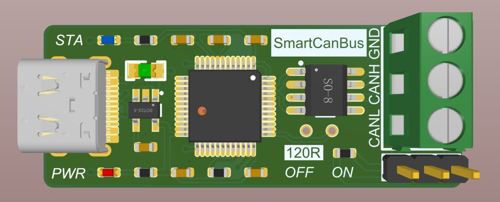

# SmartCanBus
&nbsp;&nbsp;&nbsp;&nbsp;

***

### 更新

#### version1.0.2：增加TypeC版本，重新排列元器件，规范布线，增加差分对，提升稳定性。

#### version1.0.1：第一个版本，具有基本功能，经测试功能正常。

### 简介

​	本项目的开发目的是为了拥有一个优雅的CAN分析仪，市面上大部分的CAN分析仪体积庞大，售价较贵。对于DIY爱好者来说，只需要简单的CAN调试器与上位机，查看数据包即可，购买CAN分析仪极其不划算。因此，本项目基于开源方案[candleLight](https://github.com/candle-usb/candleLight_fw/tree/master)开发，采用STM32F072CBT6作为主控（因为STM32系列中只有少数型号CAN与USB外设能够同时工作，因为大部分型号CAN与USB公用一个外设缓存区），下图为SmartCanBus的实物图，渲染效果图见Images文件夹。

***

### 开发工具

+ EDA： Altium Designer 20.0.13
+ 编译： make cmake
+ 烧录： STM32CubeProgrammer

***

### 文件目录说明

| 文件夹   | 说明               |
| -------- | ------------------ |
| Hardware | 硬件AD工程文件     |
| Images   | 图片               |
| Software | 软件、stm32固件    |
| Tools    | Zading驱动安装软件 |

---

### 参考仓库

+ candlelight：开源的CAN2USB硬件方案[candleLight](https://github.com/candle-usb/candleLight_fw/tree/master)。

+ cangaroo：开源CAN总线分析软件[cangaroo](https://github.com/HubertD/cangaroo)的仓库。

---

### 使用教程

+ [x] 项目上传Github
+ [x] 初步完善使用教程
+ [ ] 项目视频

1. 打板制作硬件
2. 下载固件并烧录
3. 使用Zading安装libusb驱动
4. 下载cangaroo，可以使用我编译好的版本https://github.com/yltzdhbc/cangaroo_win.git
5. 连接测试

---

### 个人网站

个人博客：https://yltzdhbc.top 

Github : https://github.com/yltzdhbc 

Bilibili：https://space.bilibili.com/35171315 
